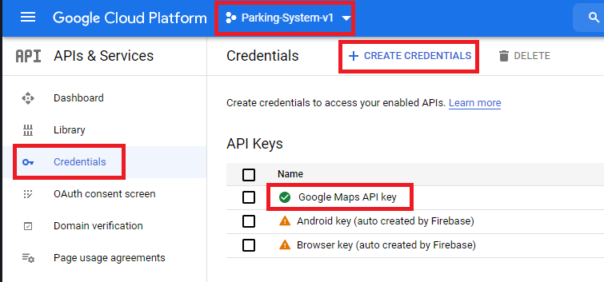
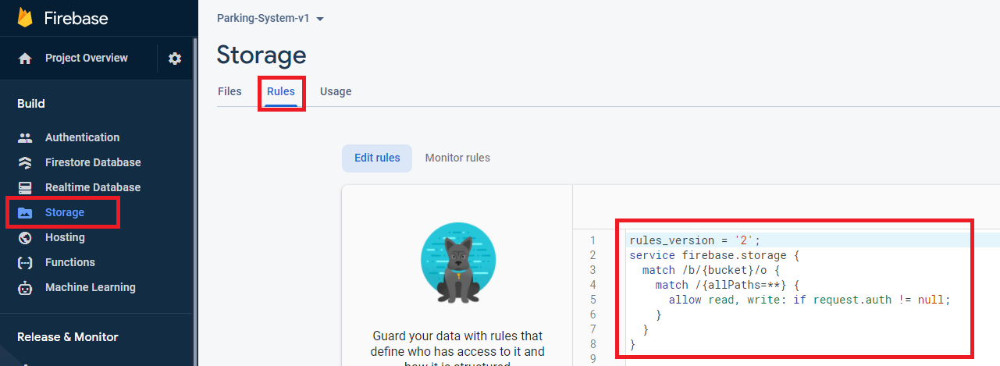
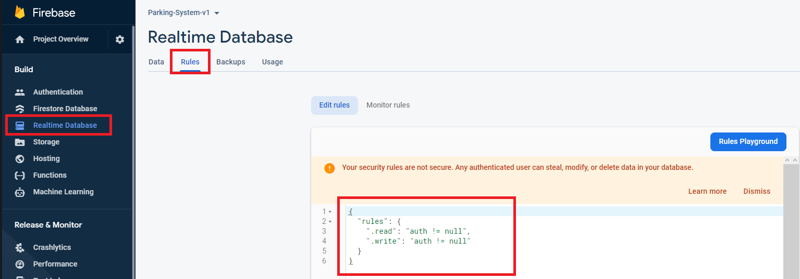
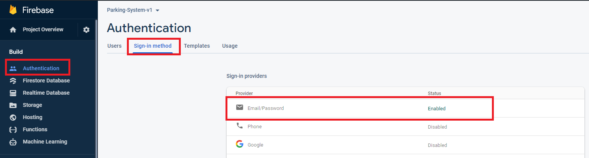
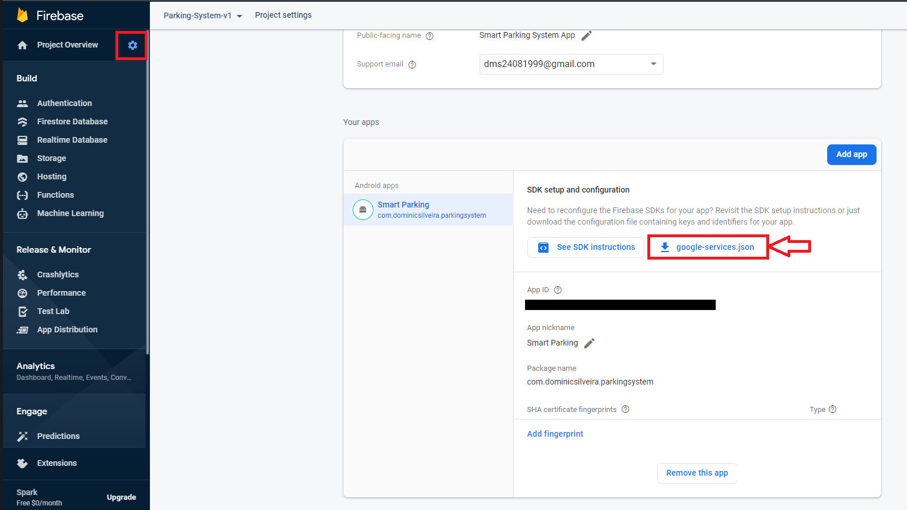
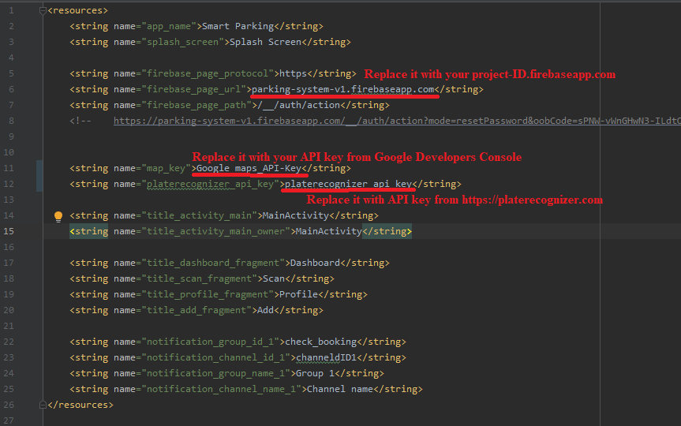

# Smart Parking
---
**Tech. Stack:** Java, Android Studio, Firebase

**Demo:** https://youtu.be/eC41zpoCmeI
- Users can find nearest parking areas and can scan the plate number and pay via UPI to book a parking area slot at the given locations and get notifications before expiry time to check-out and view history
- Parking lot owners can register parking area on Maps, add/check-out users and view history
---
**IMPORTANT NOTE:**
1. You need to create an API key for Google Maps Service on Google Developers Console and replace the value of "map_key" string tag in "app/src/main/res/values/strings.xml" with your API key from Google Developers Console.

Don't share or expose your API key with anyone or on repo, for security reasons.
2. Create a Firebase project on the Firebase website and login into your Firebase account via Android Studio too.
    - configure and setup Firebase Storage for the project.
    
    - for Firebase Realtime database, set it to production mode and set the read and write rules to "auth!=null".
    
    - for Firebase Authentication enable Email for Sign-In methods.
    
    - Go to the project settings and add/register your android app and download the "google-services.json" file and copy it to the android project root folder and /app folder.
    
3. "app/src/main/res/values/strings.xml" file

